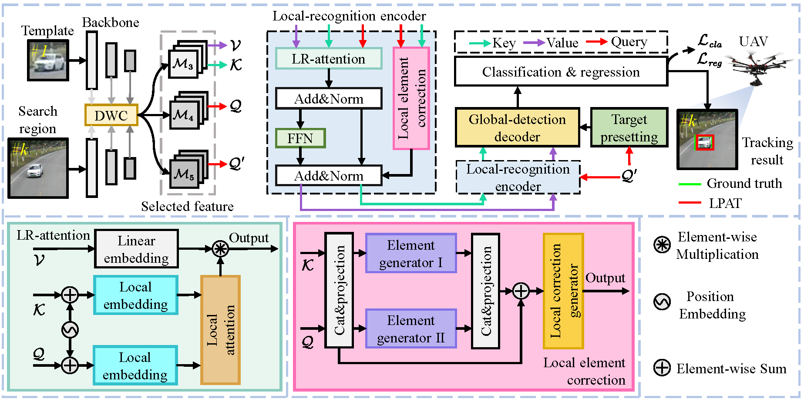

# LPAT: Local Perception-Aware Transformer for Aerial Tracking

### Changhong Fu, Weiyu Peng, Sihang Li, Junjie Ye, and Ziang Cao

## Abstract
Visual object tracking has been utilized in numerous aerial platforms, where is facing the challenges of more extremely complex conditions. To address the inefficient long-range modeling of traditional networks with fully convolutional neural networks, Transformer is introduced into the state-of-the-art trackers’ frameworks. Benefiting from full receptive field of global attention, these Transformer trackers can efficiently model long-range information. However, the structure of vanilla Transformer is lack of enough inductive bias and directly adopting global attention will lead to overfocusing on global information which does harm to modeling local details. This work proposes a local perception-aware Transformer for aerial tracking, i.e., LPAT. Specifically, this novel tracker is constructed with modified local-recognition attention and local element correction network to process information via local-modeling to global-search mechanism. To grab local details and strengthen the local inductive bias of Transformer structure. The Transformer encoder with localrecognition attention is constructed to fuse local features for accurate feature modeling and the local element correction network can strengthen the capability of both Transformer encoder and decoder to distinguish local details. The proposed method achieves competitive accuracy and robustness in several benchmarks with 316 sequences in total. The proposed tracker’s practicability and efficiency have been validated by the realworld tests on a typical aerial platform.



This figure shows the workflow of our tracker.

## Demo

- 📹 Demo of qualitative evaluations and real-world tests on [Youtube] demonstrates the practicality of LPAT.

## About Code
### 1. Environment setup
This code has been tested on Ubuntu 18.04, Python 3.8.3, Pytorch 0.7.0/1.6.0, CUDA 10.2.
Please install related libraries before running this code: 
```bash
pip install -r requirements.txt
```

### 2. Test
Download pretrained model: general_model from [BaiduNetdisk](https://pan.baidu.com/s/19rXCK1Qhm8axi9DdrCBwdA)(code:o91m) or [GoogleDrive](https://drive.google.com/file/d/1D0ot9i72NzdX_d1U9lhyj3gS76F10KVA/view?usp=sharing), and put it into `tools/snapshot` directory.

Download testing datasets and put them into `test_dataset` directory. If you want to test the tracker on a new dataset, please refer to [pysot-toolkit](https://github.com/StrangerZhang/pysot-toolkit) to set test_dataset.

```bash 
python test.py                                \
	--dataset UAV10fps                      \ # 
    --dataset_name
	--snapshot snapshot/general_model.pth  # tracker_name
```
The testing result will be saved in the `results/dataset_name/tracker_name` directory.

### 3. Train

#### Prepare training datasets

Download the datasets：
* [VID](http://image-net.org/challenges/LSVRC/2017/)
* [YOUTUBEBB](https://pan.baidu.com/s/1ZTdfqvhIRneGFXur-sCjgg) (code: t7j8)
* [COCO](http://cocodataset.org)
* [GOT-10K](http://got-10k.aitestunion.com/downloads)


**Note:** `train_dataset/dataset_name/readme.md` has listed detailed operations about how to generate training datasets.


#### Train a model
To train the SiamAPN model, run `train.py` with the desired configs:

```bash
cd tools
python train.py
```

### 4. Evaluation
We provide the tracking [results](https://pan.baidu.com/s/1EWOSHNcOldJBCCmwY-mvVA) (code: s3p1) of UAV123@10fps, UAV20L, and VisDrone2018-SOT-test. If you want to evaluate the tracker, please put those results into  `results` directory.
```
python eval.py 	                          \
	--tracker_path ./results          \ # result path
	--dataset UAV10fps                  \ # dataset_name
	--tracker_prefix 'general_model'   # tracker_name
```

### 5. Acknowledgement
The code is implemented based on [pysot](https://github.com/STVIR/pysot). We would like to express our sincere thanks to the contributors.
